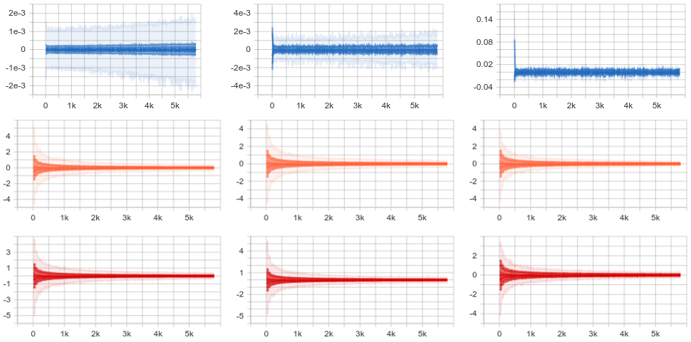
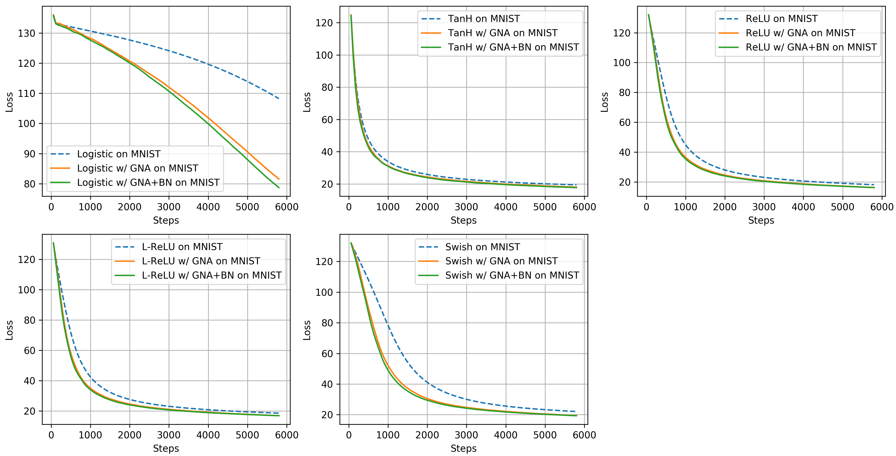

Avoiding the vanishing gradients problem by adding random noise and batch normalization 
===

## Abstract

The vanishing gradients problem is a problem that occurs in training neural networks with gradient-based learning methods and backpropagation -- the gradients will decrease to infinitesimally small values, thus preventing any update on the weights of a model. Since its discovery, several methods have been proposed to solve it. However, there have only been few attempts to compare them from both mathematical and empirical perspectives, thus the purpose of this work. We provide analyses through inspection of analytical gradients and their distribution, and classification performance of the neural networks. We also propose a simple method of adding Gaussian noise to gradients during training, coupled with batch normalization -- aimed to avoid the vanishing gradients problem. Our results show that using this approach, a neural net enjoys faster and better convergence -- having 11.25% higher test accuracy when compared to a baseline model.

## Usage

First, clone the repository.

```buildoutcfg
$ git clone https://github.com/afagarap/vanishing-gradients.git/
```

Then, we advise to make a virtual environment for installing TensorFlow 2.0

```
$ virtualenv tf2 --python=python3
```

Activate the virtual environment, and install TensorFlow 2.0

```buildoutcfg
$ source tf2/activate
$ pip install tensorflow==2.0.0-beta0
```

To run a model, refer to the following manual on parameters.

```buildoutcfg
usage: Annealing Gradient Noise Addition with Batch Normalization
       [-h] [-b BATCH_SIZE] [-e EPOCHS] [-a ACTIVATION] -n NEURONS
       [NEURONS ...]

optional arguments:
  -h, --help            show this help message and exit

Arguments:
  -b BATCH_SIZE, --batch_size BATCH_SIZE
                        the number of examples per mini batch, default is
                        1024.
  -e EPOCHS, --epochs EPOCHS
                        the number of passes through the dataset, default is
                        100.
  -a ACTIVATION, --activation ACTIVATION
                        the activation function to be used by the network,
                        default is logistic
  -n NEURONS [NEURONS ...], --neurons NEURONS [NEURONS ...]
                        the list of number of neurons per hidden layer.
```

The parameters above are standard for the [baseline model](models/baseline.py), and the experimental models ([gradient noise addition](models/anneal.py), [gradient noise addition + batch norm](models/anneal-bn.py)).

The following are the parameters accepted by `activation` parameter.

```buildoutcfg
logistic
tanh
relu
leaky_relu
swish
```

## Results

In our experiments, we used the MNIST handwritten digits classification dataset for training and evaluating our neural networks. It consists of 60,000 training examples, and 10,000 test examples -- having 28x28 pixels per image in grayscale. We reshaped each image to 784-dimensional vector, scaled them by dividing each pixel with the maximum pixel value, and added random noise from Gaussian distribution having 0 mean and 0.05 standard deviation to prevent models from overfitting and
to elevate the difficulty to converge on the dataset.

### Experiment Setup

Experiments were done in a computer with Intel Core i5-6300HQ processor, 16GB RAM, and Nvidia GeForce 960M GPU with 4GB RAM.

### Improving Gradient Values 

We observed the distribution gradients of both baseline and experimental models during training, and the distributions for a neural network with logistic activation function are depicted in Figure 1. Since this _legacy_ activation function has the least maximum gradient value of 0.25, we considered observing the changes in its distribution to be noteworthy.



**Figure 1. Gradient distribution over time of neural network with logistic activation function on MNIST dataset. _Top to bottom_: baseline model, model with gradient noise addition, and model with gradient noise addition + batch normalization.**

As we can see from the figure above, the gradient distribution of the model at hand drastically changes from the baseline configuration to the experimental configurations, i.e. from small value of -0.004 to 4. While this does not guarantee superior model performance, it does guarantee that there would be sufficient gradients to propagate through the neural network, thus avoiding the vanishing gradients problem.

### Classification Performance

We trained our neural networks using SGD with Momentum (learning rate = 3e-4, and momentum = 0.9) on the perturbed MNIST dataset for 100 epochs with mini-batch of 1024. Our networks consist of two hidden layers with 512 units each, and with Xavier initialization for their weights. The training accuracy values of the baseline and experimental models with varying activation functions are given in Figure 2, and their training loss values are given in Figure 3, while their test accuracy values are given in Table 1.

|Model|Activation|Test Accuracy|
|-----|----------|-------------|
|Baseline|Logistic|65.12%|
|GNA|Logistic|75.05% (+9.93%)|
|**GNA + BatchNorm**|**Logistic**|**76.37% (+11.25%)**|
|Baseline|TanH|91.12%|
|GNA|TanH|91.61% (+0.49%)|
|**GNA + BatchNorm**|**TanH**|**91.81% (+0.69%)**|
|Baseline|ReLU|91.62%|
|GNA|ReLU|92.37% (+0.75%)|
|**GNA + BatchNorm**|**ReLU**|**92.49% (+0.87%)**|
|Baseline|Leaky ReLU|91.38%|
|GNA|Leaky ReLU|92.02% (+0.64%)|
|**GNA + BatchNorm**|**Leaky ReLU**|**92.12% (+0.74%)**|
|Baseline|Swish|89.95%|
|GNA|Swish|90.92% (+ 0.97%)|
|**GNA + BatchNorm**|**Swish**|**91.03% (+1.08%)**|

**Table 1. Test accuracy of baseline and experimental (with gradient noise addition, and gradient noise addition + batch normalization) models on the MNIST dataset.**


**Figure 2. Training accuracy over time of baseline and experimental (with gradient noise addition, and gradient noise addition + batch normalization) models on the MNIST dataset.**



**Figure 3. Training loss over time of baseline and experimental (with gradient noise addition, and gradient noise addition + batch normalization) models on the MNIST dataset.**

We can infer from these results that the consensus among the models is they converge faster and better with gradient noise addition, and with combined gradient noise addition and batch normalization, i.e. as depicted by an early increase in training accuracy values, and by an early decrease in training loss values of the experimental models when compared to their baseline counterparts -- with minimal difference between the two experimental approaches where the latter consistently performed better than the former in the MNIST dataset. Furthermore, our results corroborate the literature and our analysis as to which activation functions perform better than the other, i.e. using the logistic function had the lowest training accuracy and highest training loss in both baseline and experimental configurations while using Swish and hyperbolic tangent improve the model performance by a considerable margin, and best performances were attained with ReLU and Leaky ReLU.

Consequently, with better convergence, the experimental models had higher test accuracy compared to the baseline models as seen in Table 1 -- notably, using our approach of combined gradient noise addition and batch normalization had the highest test accuracy. Finally, the claim on Swish outperforming ReLU did not hold in our results since our neural network had only two layers, whereas their results were on deeper networks having 12 layers like the Transformer model.

## License

```
Gradient noise addition with batch norm
Copyright (C) 2019  Abien Fred Agarap
                                                                       
This program is free software: you can redistribute it and/or modify
it under the terms of the GNU General Public License as published by
the Free Software Foundation, either version 3 of the License, or
(at your option) any later version.
                                                                       
This program is distributed in the hope that it will be useful,
but WITHOUT ANY WARRANTY; without even the implied warranty of
MERCHANTABILITY or FITNESS FOR A PARTICULAR PURPOSE.  See the
GNU General Public License for more details.
                                                                       
You should have received a copy of the GNU General Public License
along with this program.  If not, see <https://www.gnu.org/licenses/>.
```
