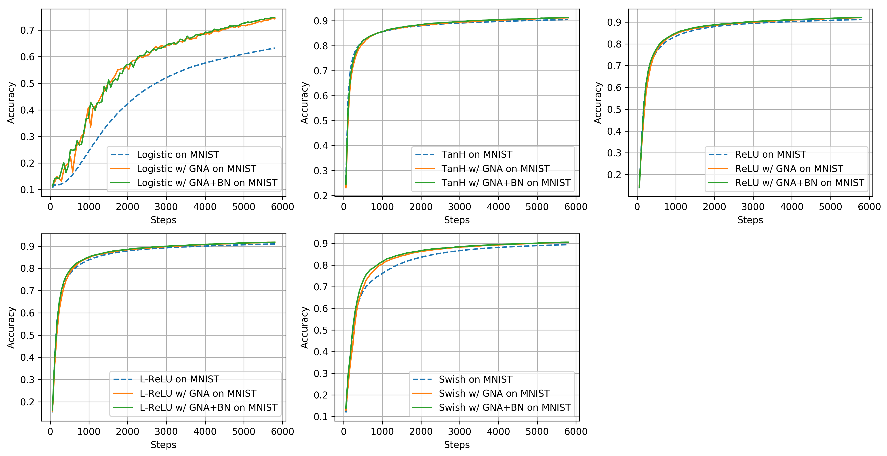

Avoiding the vanishing gradients problem by gradient self-augmentation
===

_by Abien Fred Agarap, Joshua Raphaelle Cruzada, Gabrielle Marie Torres, Ralph Vincent Regalado, Charibeth Cheng, and Arnulfo Azcarraga, PhD_

## Abstract

The vanishing gradients problem is a problem that occurs in training neural networks with gradient-based learning methods and backpropagation -- the gradients will decrease to infinitesimally small values, thus preventing any update on the weights of a model. Since its discovery, several methods have been proposed to solve it. However, there have only been few attempts to compare them from both mathematical and empirical perspectives, thus the purpose of this work. We provide analyses through inspection of analytical gradients and their distribution, and classification performance of the neural networks. We also propose a novel method of adding Gaussian noise to gradients during training, coupled with batch normalization -- aimed to avoid the vanishing gradients problem. Our results show that using this approach, a neural net enjoys faster and better convergence -- having 11.25% higher test accuracy when compared to a baseline model.

## Results

### Experiment Setup

### Improving Gradient Values 

### Classification Performance

## License
