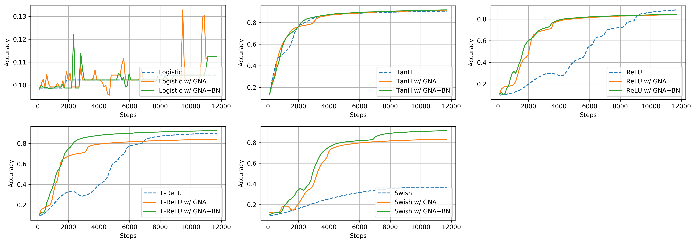
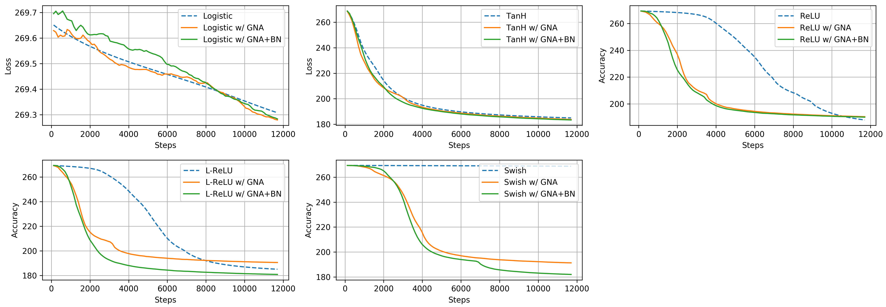

Avoiding the vanishing gradients problem by adding random noise and batch normalization 
===

## Abstract

The vanishing gradients problem is a problem that occurs in training neural networks with gradient-based learning methods and backpropagation -- the gradients will decrease to infinitesimally small values, thus preventing any update on the weights of a model. Since its discovery, several methods have been proposed to solve it. However, there have only been few attempts to compare them from both mathematical and empirical perspectives, thus the purpose of this work. We provide analyses through inspection of analytical gradients and their distribution, and classification performance of the neural networks. We also propose a simple method of adding Gaussian noise to gradients during training, coupled with batch normalization -- aimed to avoid the vanishing gradients problem. Our results show that using this approach, a neural net enjoys faster and better convergence -- having 54.47% higher test accuracy when compared to a baseline model.

## Usage

First, clone the repository.

```buildoutcfg
$ git clone https://github.com/afagarap/vanishing-gradients.git/
```

Then, we advise to make a virtual environment for installing TensorFlow 2.0

```
$ virtualenv tf2 --python=python3
```

Activate the virtual environment, and install TensorFlow 2.0

```buildoutcfg
$ source tf2/activate
$ pip install tensorflow==2.0.0-beta0
```

To run a model, refer to the following manual on parameters.

```buildoutcfg
usage: Annealing Gradient Noise Addition with Batch Normalization
       [-h] [-b BATCH_SIZE] [-e EPOCHS] [-a ACTIVATION] -n NEURONS
       [NEURONS ...]

optional arguments:
  -h, --help            show this help message and exit

Arguments:
  -b BATCH_SIZE, --batch_size BATCH_SIZE
                        the number of examples per mini batch, default is
                        1024.
  -e EPOCHS, --epochs EPOCHS
                        the number of passes through the dataset, default is
                        100.
  -a ACTIVATION, --activation ACTIVATION
                        the activation function to be used by the network,
                        default is logistic
  -n NEURONS [NEURONS ...], --neurons NEURONS [NEURONS ...]
                        the list of number of neurons per hidden layer.
```

The parameters above are standard for the [baseline model](models/baseline.py), and the experimental models ([gradient noise addition](models/anneal.py), [gradient noise addition + batch norm](models/anneal-bn.py)).

The following are the parameters accepted by `activation` parameter.

```buildoutcfg
logistic
tanh
relu
leaky_relu
swish
```

## Results

In the experiments that follow, the MNIST handwritten digits classification dataset was used for training and evaluating our neural networks. Each image was reshaped to a 784-dimensional vector, and then normalized by dividing each pixel value with the maximum pixel value (i.e. 255), and added random noise from a Gaussian distribution with a standard deviation of 5e-2 to elevate the difficulty to converge on the dataset.

### Experiment Setup

Experiments were done in a computer with Intel Core i5-6300HQ processor, 16GB RAM, and Nvidia GeForce 960M GPU with 4GB RAM. The random seed used was 42 both in TensorFlow and NumPy.

### Improving Gradient Values 

During training, we can observe the gradient distributions of a neural network as it learns. In Figure 2, we take a neural network with logistic activation function as an example. Since the logistic activation function has the least maximum gradient value (i.e. 0.25), we can consider observing the changes in its gradient distribution to be noteworthy.


**Figure 1. Gradient distribution over time of neural network with logistic activation function on MNIST dataset. _Top to bottom_: baseline model, model with gradient noise addition, and model with gradient noise addition + batch normalization.**

As we can see from the graphs above, the gradient distributions of the model drastically change from the baseline configuration to the experimental configurations, i.e. from considerably small values (+/- 4e-3 for two-layered neural network, and +/- 5e-6 for five-layered neural network) to relatively large values (+/- 4 for both two-layered and five-layered neural networks). While this does not guarantee superior model performance, it does give us an insight that there would be sufficient gradient values to propagate within the neural network, thus avoiding vanishing gradients. We turn to the next subsection to examine the classification performance of the models.

### Classification Performance

The models were trained using stochastic gradient descent (SGD) with Momentum (learning rate α = 3e-4, momentum γ = 9e-1) on the perturbed MNIST dataset for 100 epochs, with mini-batch size of 1024 (for the two-layered neural network), and mini-batch size of 512 (for the five-layered neural network). Our networks consist of (1) two hidden layers with 512 neurons each, and (2) five hidden layers with the following neurons per hidden layer: 512, 512, 256, 256, 128. The weights for both the network architectures were initialized with Xavier initialization.
We can observe in Figures 3–6 that using the experimental methods, Gradient Noise Addition (GNA) and GNA with Batch Normalization (BN), help the neural net to converge faster and better in terms of loss and accuracy.

|Model|Activation|Test Accuracy on 2-layer NN|Test Accuracy on 5-layer NN|
|-----|----------|---------------------------|---------------------------|
|Baseline|Logistic|65.12%|10.28%|
|**GNA**|Logistic|75.05% (+9.93%)|**11.35% (+1.07%)**|
|**GNA + BatchNorm**|**Logistic**|**76.37% (+11.25%)**|11.35%|
|Baseline|TanH|91.12%|91.27%|
|GNA|TanH|91.61% (+0.49%)|91.78% (+0.51%)|
|**GNA + BatchNorm**|**TanH**|**91.81% (+0.69%)**|**92.15% (+0.88%)**|
|**Baseline**|ReLU|91.62%|**88.65%**|
|GNA|ReLU|92.37% (+0.75%)|83.62% (-5.03%)|
|**GNA + BatchNorm**|**ReLU**|**92.49% (+0.87%)**|84.40% (-4.25%)|
|Baseline|Leaky ReLU|91.38%|90.43%|
|GNA|Leaky ReLU|92.02% (+0.64%)|83.34% (-7.09%)|
|**GNA + BatchNorm**|**Leaky ReLU**|**92.12% (+0.74%)**|**92.39% (+1.88%)**|
|Baseline|Swish|89.95%|37.18%|
|GNA|Swish|90.92% (+ 0.97%)|83.10% (+45.92%)|
|**GNA + BatchNorm**|**Swish**|**91.03% (+1.08%)**|**91.65% (+54.47%)**|

**Table 1. Test accuracy of baseline and experimental (with gradient noise addition, and gradient noise addition + batch normalization) 2-layer and 5-layer models on the MNIST dataset.**


**Figure 2. Training accuracy over time of baseline and experimental (with gradient noise addition, and gradient noise addition + batch normalization) two-layered neural networks on the MNIST dataset.**


**Figure 3. Training loss over time of baseline and experimental (with gradient noise addition, and gradient noise addition + batch normalization) two-layered neural networks on the MNIST dataset.**



**Figure 4. Training accuracy over time of baseline and experimental (with gradient noise addition, and gradient noise addition + batch normalization) five-layered neural networks on the MNIST dataset.**



**Figure 5. Training loss over time of baseline and experimental (with gradient noise addition, and gradient noise addition + batch normalization) five-layered neural networks on the MNIST dataset.**

From Table 1, we can see the test accuracy values using GNA and GNA+BN drastically improved - most notably on the logistic-based neural network.

We have seen that all the baseline two-layered neural networks improved with GNA and GNA+BN from the results tallied. However, for the five-layered neural networks, the ReLU-based model failed to improve in terms of test accuracy. Furthermore, we can see that the TanH-based neural network had a better test accuracy in this configuration than the ReLU-based model. We can attribute this to the fact that we used Xavier initialization (in which TanH performs optimally) rather than He initialization (in which ReLU performs optimally).

In general, these results on the five-layered neural network support the statement earlier that the inflation of gradient values do not necessarily guarantee superior performance.

But what's interesting here is the drastic improvement of the baseline model with Swish activation function-an increase in test accuracy as high as 54.47%.

Despite the results for the two-layered neural network where the Swish-based model had slightly lower test accuracies than the ReLU- and Leaky RELU-based ones, we can see that for the five-layered neural network, the Swish-based model had a higher test accuracy than the ReLU-based models (but slightly lower than the Leaky ReLU-based model). This somehow corroborates the fact the Swish outperforms ReLU on deeper networks as exhibited by [Ramachandran et al. (2017)](https://arxiv.org/abs/1710.05941v1) on their results for their 12-layer Transformer model.

## License

```
Gradient noise addition with batch norm
Copyright (C) 2019  Abien Fred Agarap
                                                                       
This program is free software: you can redistribute it and/or modify
it under the terms of the GNU General Public License as published by
the Free Software Foundation, either version 3 of the License, or
(at your option) any later version.
                                                                       
This program is distributed in the hope that it will be useful,
but WITHOUT ANY WARRANTY; without even the implied warranty of
MERCHANTABILITY or FITNESS FOR A PARTICULAR PURPOSE.  See the
GNU General Public License for more details.
                                                                       
You should have received a copy of the GNU General Public License
along with this program.  If not, see <https://www.gnu.org/licenses/>.
```
